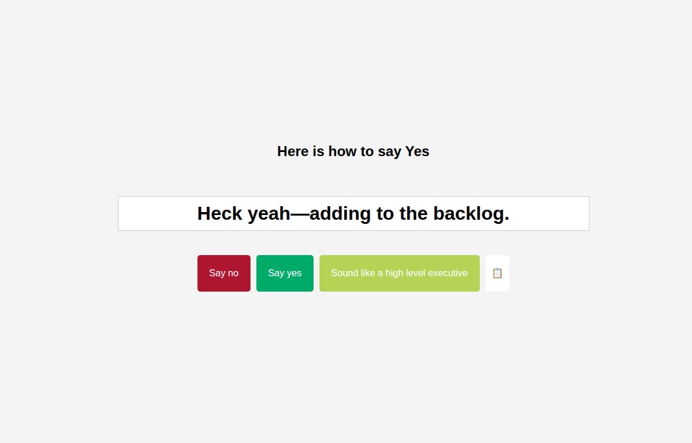

# Jargon as a Service (JaaS)

Available at [https://jaas.diegoc.io](https://jaas.diegoc.io/) (limited to 60 rpm per IP, please be nice to my potato homelab)

Jargon that you might've heard in the workplace, or might want to use (at your own risk).



## Usage

```
GET /api/categories
```

```
GET /api/phrases/:category
```

```
GET /api/jargon
```

### Self host

docker-compose.yml
```yaml
services:
  jargon-aas:
    container_name: jargon-aas
    build: https://github.com/diegoc-am/jargon-as-a-service.git
    ports:
        - "9292:9292"
```

### Examples

- [executive_coercion](https://jaas.diegoc.io/api/phrases/executive_coercion/sample)
- [yes](https://jaas.diegoc.io/api/phrases/yes/sample)
- [no](https://jaas.diegoc.io/api/phrases/no/sample)

## Contributing

1. Fork
2. Add a category/phrases
3. Submit a PR
4. Talk to your co-workers

## Credits

- Heavily inspired by [hotheadhacker/no-as-a-service](https://github.com/hotheadhacker/no-as-a-service), I said no to being creative with my own phrases and hijacked the ones in that repository. The other ones were created through LLMs

- Years of software development

